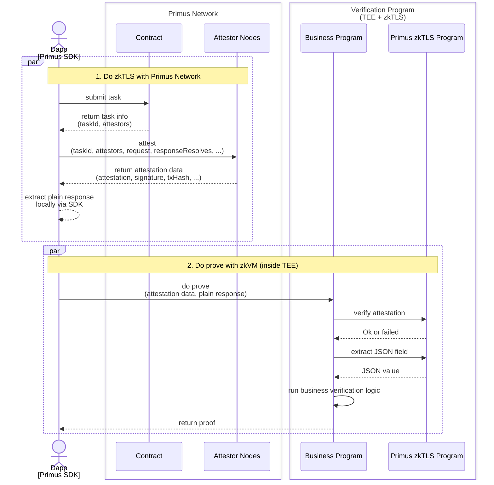

# DVC-Intro

## Introduction

**DVC (Data Verification and Computation) mode** is a workflow in which Primus uses **zkTLS** to verify the correctness and authenticity of HTTPS requests and responses by **proving the encrypted TLS transcript directly**, without executing any business logic itself.
In this mode, Primus is responsible only for data verification, while **all actual computation is delegated to external zkVMs**, which consume the verified data and execute the business logic independently.

## Components

* **Dapp**: An application built by developers using the **Primus Network SDK**.
* **[Primus Network SDK](https://docs.primuslabs.xyz/primus-network/build-with-primus/overview)**: A toolkit that helps developers integrate the zkTLS protocol into their applications.
* **[Primus Network](https://docs.primuslabs.xyz/primus-network/understand-primus-network)**: The foundational layer of the zkTLS protocol, providing decentralized security and robustness while enabling data verification and monetization.
* **Verification Program**: Composed of two programs running inside a TEE:
  * **Primus zkTLS Verification Program**: A standard Rust program provided by Primus. Running in a TEE and zkVM environment, it cryptographically verifies attestation signatures, validates data source URLs and responses, and extracts response payloads.
  * **Business Rust Program**: A developer-built Rust application running in a TEE + zkVM environment. It receives zkTLS attestations generated by the Dapp and performs domain-specific business logic.

## Workflow

## Do zkTLS with Primus Network

### 1. Task Submission

Your Dapp first submits a task to the **Primus Network**. The network returns:

* a **task ID**, and
* a list of **attestors**, the compute nodes assigned to perform zkTLS.

### 2. Attestation Execution

Your Dapp performs the zkTLS protocol collaboratively with the attestor node in the Primus Network. The attestor completes the protocol and returns:

* an **attestation**,
* its **signature**,
* and additional metadata such as `txHash`.

### 3. Private Data Extraction

Using the Primus SDK locally, the Dapp extracts the **plaintext response** — without sending anything back to the network.

## Do Proving with zkVM

Next, the Dapp sends  the **attestation** and the **plaintext response** to the **Verification Program** running inside a TEE (with zkVM).

Inside the TEE (with zkVM):

1. The **Business Program** calls the **Primus zkTLS Verification Program** to verifies:

   * the attestation signature,
   * the source URL,
   * and the correctness of the response.
2. Upon successful verification, the Business Program:

   * extracts the required JSON fields,
   * and performs its own domain-specific business logic.
3. Finally, the zkVM returns a proof back to the Dapp.

## Try the Full Workflow with the Demo

A complete [demo](https://github.com/primus-labs/DVC-Demo) is available for you to try the entire workflow end-to-end.
